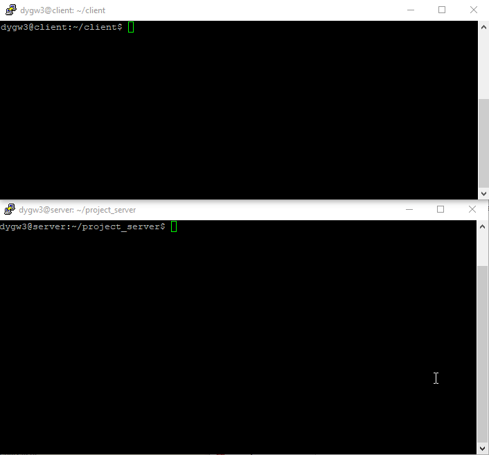
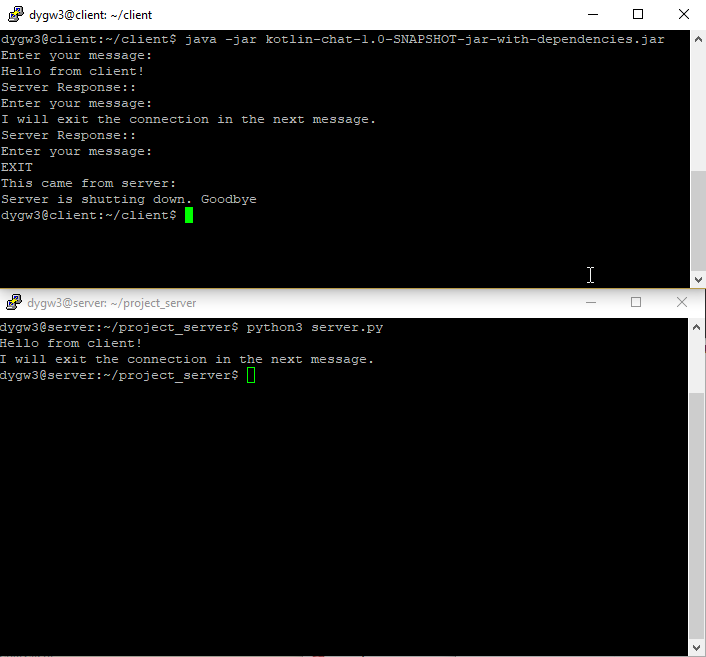

# Network Architecture I - Project 1 - Part 2

This project for Network Architecture I is split into two parts.

## Overview

### Tasks:
Develop a simple chat program using two different programming languages; one for the server, and one for the clients.

1. A chat server that will accept a single client connection and display everything the client types. When client types 'exit', both client and server end
2. Allow the server to remain open for additional connections once a client quits. The server handles at most one connection
3. Allow the server to handle multiple clients at once. Output from all the connected clients shows on the server
4. Allow the server to echo messages received from any client to all other connected clients

## Introduction

The two programming languages used for this assignment are: Python and Kotlin. Each task stated in the overview will have its own section under 'Process' containing the screenshots of the exchanges.

[GENI](https://portal.geni.net/) was used to setup the server and clients.

## Process

### Task 1

Demo of Task 1

Screenshot of Task 1

## References

[Lipsum](https://www.lipsum.com/feed/html) - Used to generate text to meet the file size requirements

[SSH.com](https://www.ssh.com/ssh/putty/putty-manuals/0.68/Chapter6.html#psftp-starting) - Used for reference on transferring files using PSFTP

[Baeldung](https://www.baeldung.com/a-guide-to-java-sockets) - Used for reference on socket programming in Java - converted to Kotlin