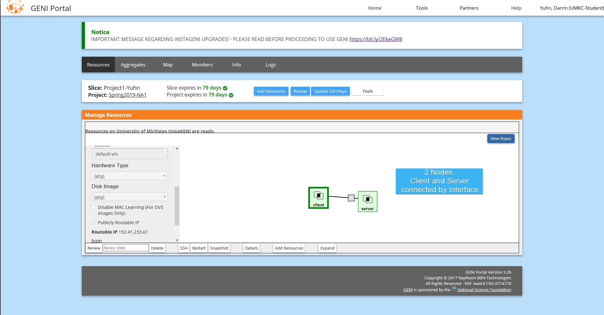
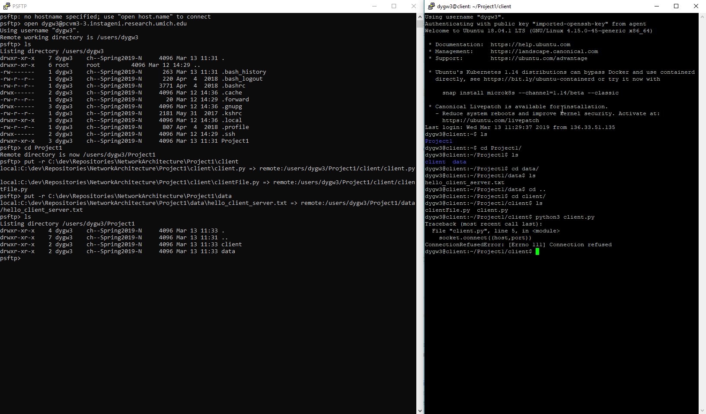

# Network Architecture I - Project 1

This project for Network Architecture I is split into two parts.

## Part 1:

### Task:
Develop and deploy a simple TCP client and server programs on [GENI](https://portal.geni.net/).

Show the screenshots of simple message exchanges.

 * (20%) Start from client message ‘Hello from Client-your names’ and server responses
with ‘Hello from Server-your names’. Then messages from each side are echoed to each
other. The program quit the program with typing ‘Bye from Client-your name’ and ‘Bye
from Server-your name’.

* (30%) A client sends a large text file (> 10KB) to a server. (A small file transfer will
receive only a partial credit (10% only)
Server prints the file on the screen,
Server saves the file in a local system,
Server appends one more line (eg. ‘This is an added line from a server) to the file,
And send the updated file back to the client.
Client shows the file on the screen after it fully receives the file.

### Steps

To begin, a slice was created on the GENI Portal with two resources: client and server.

With the resources created, each node was connected to using Putty and a private SSH key. The language used for this project was Python and the PyCharm IDE was used.

To send the files to the nodes, PSFTP was used to securely send the files through an SSH connection. The server node received the files relevant for the server, and the client node received the files relevant for the client.

Screenshot of PSFTP commands and directories for Server node.

Screenshot of PSFTP commands and directories for Client node.

