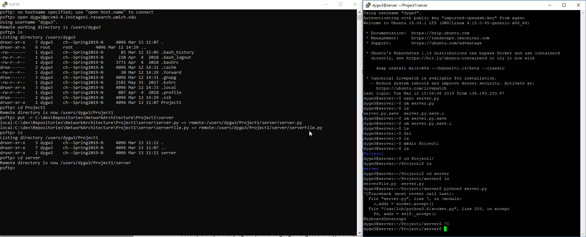
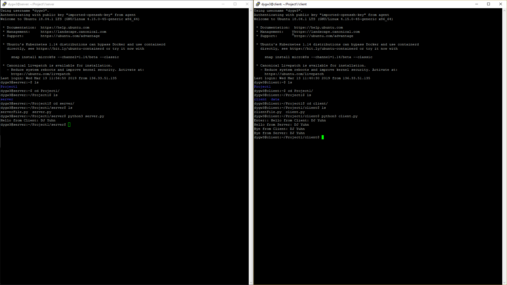

# Network Architecture I - Project 1

This project for Network Architecture I is split into two parts.

## Part 1:

### Task:
Develop and deploy a simple TCP client and server programs on [GENI](https://portal.geni.net/).

Show the screenshots of simple message exchanges.

 * (20%) Start from client message ‘Hello from Client-your names’ and server responses
with ‘Hello from Server-your names’. Then messages from each side are echoed to each
other. The program quit the program with typing ‘Bye from Client-your name’ and ‘Bye
from Server-your name’.

* (30%) A client sends a large text file (> 10KB) to a server. (A small file transfer will
receive only a partial credit (10% only)
Server prints the file on the screen,
Server saves the file in a local system,
Server appends one more line (eg. ‘This is an added line from a server) to the file,
And send the updated file back to the client.
Client shows the file on the screen after it fully receives the file.

### Steps

In this section I will provide an overview of the process in creating the resources for the first part of the project. Part A of this section will provide screenshots and gifs of the process to create the resources and sending a message from the client node to the server node and then the server responding.

Part B of this section will provide a gif and a screenshot of the process to transfer a file of size greater than 10 KB from the client node to the server node. The size of this file is roughly 18KB, as seen under the `data` directory of this project. The server then saves this file locally and returns back the file to the client with an appended message of the server saying Hello!


#### PART A

To begin, a slice was created on the GENI Portal with two resources: client and server.


With the resources created, each node was connected to using Putty and a private SSH key. The language used for this project was Python and the PyCharm IDE was used.

To send the files to the nodes, PSFTP was used to securely send the files through an SSH connection. The server node received the files relevant for the server, and the client node received the files relevant for the client and the `hello_client_server.txt`


Screenshot of PSFTP commands and directories for Server node.


Screenshot of PSFTP commands and directories for Client node.

With the respective code on each of the nodes, to demonstrate that the messages are being sent correctly from client to server and then a response from server to client, see the gif and image below.


Gif of the client and server communicating a greeting.

Below is the final image:




#### PART B

In this section the client must transfer a file of size greater than 10 KB to the server. The server will save this file locally and then append a message before returning the file to the client. Due to the file size, this part required specifying the length of the message to be sent in order to keep the socket open for continually retrieving the message. That is, if the message length was not sent and the message was greater than the buffer size specified then only a part of the message would be considered. Additionally, the TCP protocol may send the stream of bytes with various lengths, thus in the following code the length of the chunk needed to be considered rather than the entirety of the byte size expected when increasing the `running_byte_size` variable:

```python
def receive_all(sock, byte_size):
    running_byte_size = 0
    data_fragments = []
    while running_byte_size < byte_size:
        byte_difference = byte_size - running_byte_size
        chunk = sock.recv(byte_difference)
        if not chunk:
            return None
        data_fragments.append(chunk)
        running_byte_size += len(chunk)

    return b"".join(data_fragments)
```


Gif of the client and server transferring a file.


Image of the final output of transferring a file.


## References

[Lipsum](https://www.lipsum.com/feed/html) - Used to generate text to meet the file size requirements

[SSH.com](https://www.ssh.com/ssh/putty/putty-manuals/0.68/Chapter6.html#psftp-starting) - Used for reference on transferring files using PSFTP